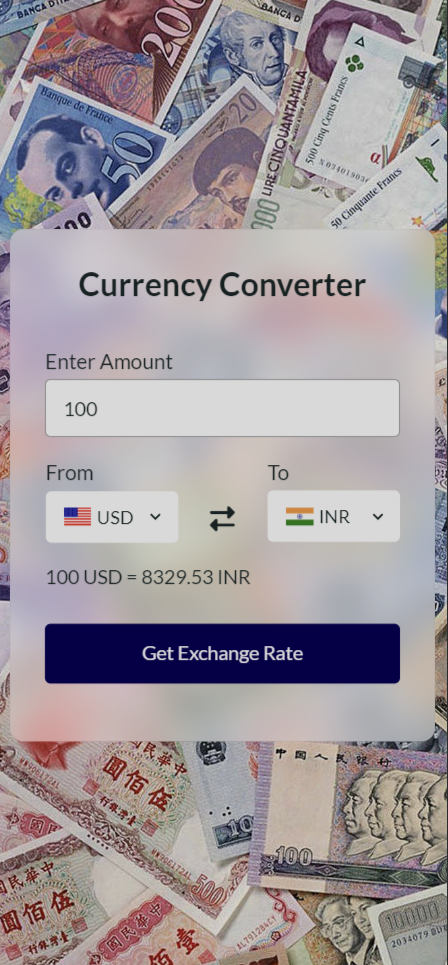

# Currency Converter

A simple and effective currency converter implemented using HTML, CSS, and JavaScript.

## Table of Contents

- [Introduction](#introduction)
- [Features](#features)
- [Demo](#demo)
- [Screenshots](#screenshots)
- [Dependencies](#dependencies)

## Introduction

Welcome to the Currency Converter project! This web application allows users to convert currency with ease. It is designed with simplicity and efficiency in mind, providing real-time exchange rates for accurate conversions.

## Features

- **User-Friendly Interface**: The intuitive design ensures a seamless and user-friendly experience.
- **Real-time Exchange Rates**: The application fetches up-to-date exchange rates using the [ExchangeRate-API](https://www.exchangerate-api.com/), ensuring accurate and reliable conversions.
- **Responsive Design**: The layout is responsive, making it accessible on various devices, including desktops, tablets, and smartphones.

## Demo

Check out the live demo of the Currency Converter: [Currency Converter Demo](https://jaiswalism.github.io/currency-converter/)

## Screenshots

### Desktop View

### Mobile View

## Dependencies

List of third-party libraries and APIs used in the project:

- [ExchangeRate-API](https://www.exchangerate-api.com/) - Provides real-time exchange rates for accurate currency conversions.
